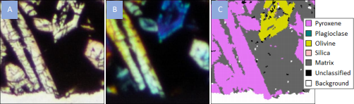
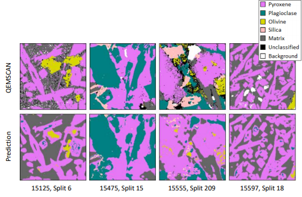

## Multi-mineral classification of Apollo 15 Lunar microscopy samples through machine learning.

### MSc Data Science 18-20 PT  
###Birkbeck College, University of London

### Abstract

This study analyses the potential to perform multi-mineral classification of Lunar basalts through machine learning, using microscopy data collected from Apollo 15 mission samples. Sample mineralogy is predominantly composed of Pyroxene, Plagioclase Feldspar and fine-grained matrix. Labels are provided through scanning electron microscope derived QEMSCAN mineral interpretations. Innovative methodologies are applied to standardise image quality through pre-processing and perform pixelwise alignment between microscopy images and QEMSCAN data creating a dataset of 66.3M pixels.

  
**Figure**: Aligned images (Sample 15125, Split 6): A. PPL; B. XPL; C. QEMSCAN interpretation.

A wide range of features are considered to represent variation in mineral colour, structural and textural response of the minerals captured through imaging. Following analysis of pre-processing and model classification pipelines, a gradient boosting machine classifier is defined using an optimised feature set and parameterisation. Model performance is strongly driven by colour features, showing an overall accuracy of 81.1% and Dice similarity coefficient of 0.66. Performance is predominantly achieved through accurate prediction of predominant mineralogies, struggling to correctly classify Olivine and Silica, for which feature properties are demonstrated to overlap significantly with Pyroxene. Finally, an end-user web-based application is created to demonstrate potential usage of the classification model for use in routine analysis of rock composition.

  
**Figure**: Example LGBM prediction for each study sample.